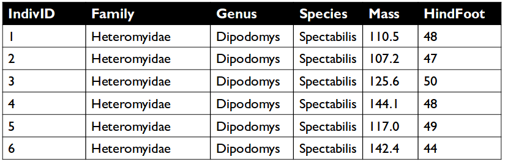
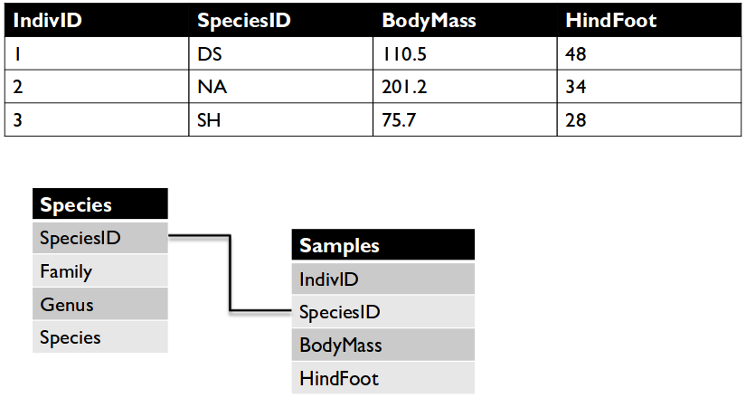
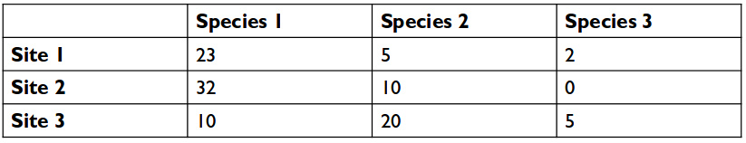
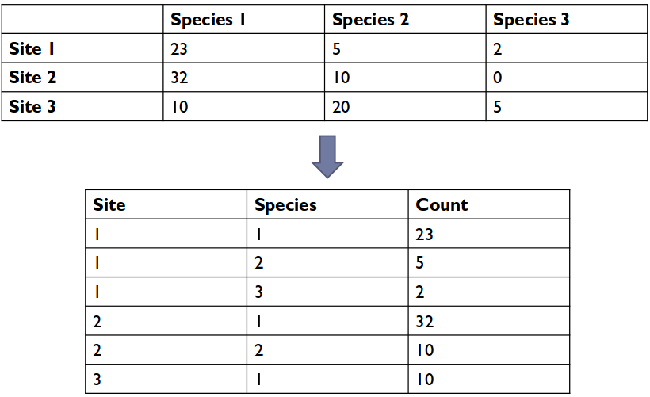

---
layout: page
element: notes
title: Tidy Database Structure
language: R
--- 

## Multiple tables

* It is often not efficient to include all information of interest in a single
table.

* To solve these problems we store data in multiple tables
* And connect the data in different tables using Joins or Relationships (hence
  "relational" database)
* Each table contains a single data type

## Alternative structures

Cross-tablulated data

