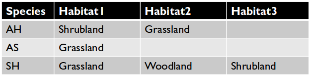

## Five basic rules of database structure

1. Order doesn’t matter
    * The information should not be dependent on the order of the rows or the
      order of the columns
2. No duplicate rows
3. Every row - column combination contains one value
4. One field per type of information
5. No redundant information

## Order doesn't matter

## No duplicate rows

## One value per cell

Don't do this.

How would you query for Shrubland?

## One column per type of information

Don't do this either.

How would you query for records with Grassland and Shrubland?

## Proper structure

This lets us easily subset the data however we want.

## No redundant information

