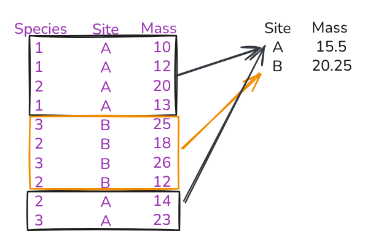

### Setup

```r
install.packages(c('dplyr', 'readr', 'tidyr'))
download.file("https://ndownloader.figshare.com/files/2292172", "surveys.csv")
download.file("https://ndownloader.figshare.com/files/3299474", "plots.csv")
download.file("https://ndownloader.figshare.com/files/3299483", "species.csv")
download.file("https://www.datacarpentry.org/semester-biology/data/shrub-volume-data.csv", "shrub-volume-data.csv")
```

### Basic aggregation

```r
surveys <- read_csv("surveys.csv")
```

* Aggregation combines rows into groups based on one of more columns.
* Calculates combined values for each group.



* First step, group the data frame.
* Let's group it by `year`
* `group_by`
* Arguments: 1) table to work on; 2) columns to group by

```r
group_by(surveys, year)
```

* The tibble produced by this function has grouping information
* Store the data frame in a variable to use in the next step

```r
surveys_by_year <- group_by(surveys, year)
```

* After grouping a data frame use `summarize()` to calculate values for each group.
* Count the number of rows for each group (individuals in each species).

* First argument is the table to work on
* Needs to be a grouped table
* One additional argument for each calculation we want to do for each group
* Column name to store calculated value, `=`, calculation to perform for each group
* We'll use the function `n` which is a special function that counts the rows in the table

```r
counts_by_year <- summarize(surveys_by_year, abundance = n())
```

* Use any function that returns a single value from one or more vectors
* E.g., mean, max, min
* We'll calculate the the average weight of individuals in each year
* Use pipes this time

```r
size_abundance_data <- surveys |>
  group_by(year) |>
  summarize(avg_weight = mean(weight))
```

* *Open table*
* Why did we get `NA`?
* `mean(weight)` returns `NA` when `weight` has missing values (`NA`)
* Can fix using `drop_na(weight)`

```r
size_abundance_data <- surveys |>
  drop_na(weight) |>
  group_by(year) |>
  summarize(avg_weight = mean(weight))
```

> Do [Penguins Data Aggregation 1-3]({{ site.baseurl }}/exercises/Penguins-data-aggregation-R/).

* We can also do multiple calculations at once using summarize
* Count the number of individuals and determine their average weight in each year

```r
surveys_by_plot_year <- surveys |>
  drop_na(weight) |>
  group_by(year) |>
  summarize(abundance = n(), avg_weight = mean(weight))
```

* Can also group by multiple columns
* Count the number of individuals and determine their average weight in each plot in each year

```r
surveys_by_plot_year <- surveys |>
  drop_na(weight) |>
  group_by(year, plot_id) |>
  summarize(abundance = n(), avg_weight = mean(weight))
```

* Note the message about "grouped output"
* It says that the resulting data frame is grouped by `year`
* When we group by more than one column the resulting data frame is grouped by all but the last group
* Can be useful in some more complicated circumstances
* Can also make things not work if functions don't support grouped data frames
* To remove these groups add `.groups = "drop"` as an optional arugment

```r
size_abundance_data <- surveys |>
  drop_na(weight) |>
  group_by(year, plot_id) |>
  summarize(abundance = n(), avg_weight = mean(weight), .groups = "drop")
```

* Or you can add `ungroup()` to the end of the pipeline
* But then the message still prints because it happens as part of the `summarize` step

* Looking at the resulting data frame

```r
size_abundance_data
```

* Shows us that the final data frame is ungrouped

> Do [Shrub Volume Aggregation 1-2]({{ site.baseurl }}/exercises/Dplyr-shrub-volume-aggregation-R/).
